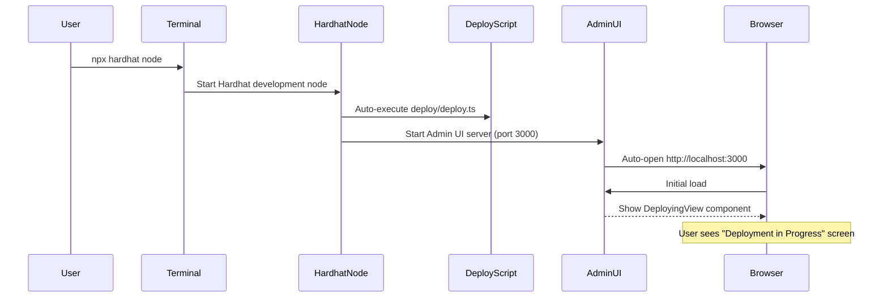
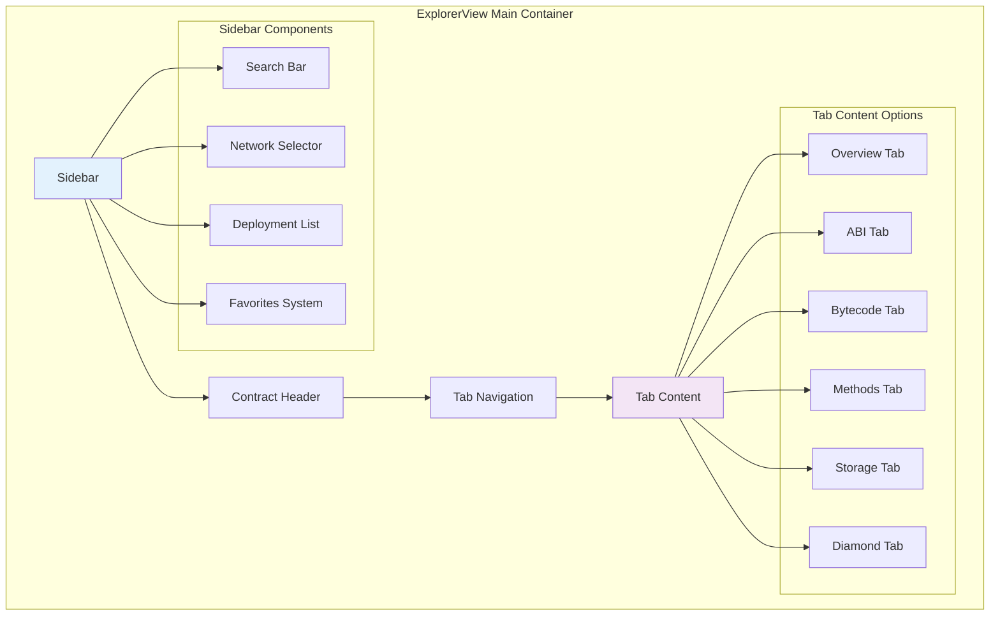
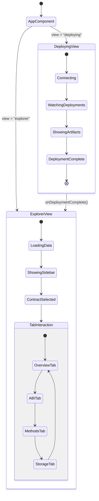
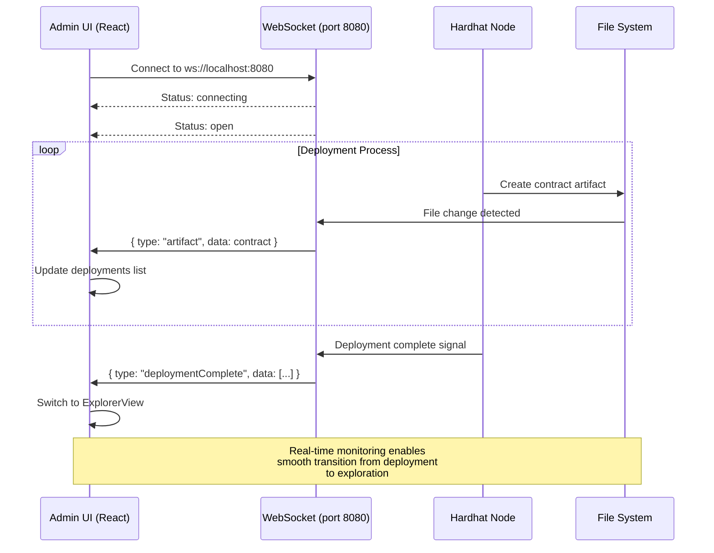

# Hardhat Admin UI - User Flow & Architecture Diagrams

## Overview

This document provides comprehensive diagrams documenting the Hardhat Admin UI application flow from initial startup through deployment monitoring to contract exploration.

## 1. Application Startup Flow



## 2. Deployment Monitoring Phase

```mermaid
flowchart TD
    A[User starts Hardhat node] --> B[DeployingView loads]
    B --> C[WebSocket connects to ws://localhost:8080]
    C --> D{WebSocket Status}
    
    D -->|Connecting| E[Show "Connecting to Hardhat..."]
    D -->|Open| F[Show "Watching for deployments..."]
    D -->|Error| G[Show "Connection error"]
    D -->|Closed| H[Show "Connection closed"]
    
    F --> I[Listen for artifact messages]
    I --> J[Deploy SimpleStorage]
    J --> K[Display: SimpleStorage deployed]
    K --> L[Deploy SimpleToken]
    L --> M[Display: SimpleToken deployed]
    M --> N[Deploy Marketplace]
    N --> O[Display: Marketplace deployed]
    O --> P[Populate with sample data]
    P --> Q[Receive deploymentComplete message]
    Q --> R[Switch to ExplorerView]
    
    style A fill:#e1f5fe
    style R fill:#c8e6c9
```

## 3. Contract Explorer Architecture



## 4. Final State - Contract Explorer

```mermaid
graph LR
    subgraph "Browser Window - http://localhost:3000"
        subgraph "Left Sidebar (25%)"
            A[Hardhat Explorer]
            B[Search: Filter contracts]
            C[Network: localhost]
            D[🌟 Favorites]
            E[📄 SimpleStorage<br/>0x5FbDB...0aa3]
            F[🪙 SimpleToken<br/>0xe7f17...6e12]
            G[🛒 Marketplace<br/>0x9fE46...6e0]
        end
        
        subgraph "Main Content Area (75%)"
            subgraph "Header"
                H[Selected Contract: SimpleStorage]
                I[Address: 0x5FbDB2315678afecb367f032d93F642f64180aa3]
            end
            
            subgraph "Tab Navigation"
                J[Overview] 
                K[ABI]
                L[Bytecode]
                M[Methods]
                N[Storage]
                O[Diamond]
            end
            
            subgraph "Content Panel"
                P[Contract Details Card<br/>• Constructor Args: [42]<br/>• Block: 1<br/>• Gas Used: 348,748]
                Q[Deployment Info Card<br/>• Deployer: 0xf39F...2266<br/>• Timestamp: Current<br/>• Network: hardhat]
                R[Recent Transactions<br/>• setValue(100)<br/>• increment()]
            end
        end
    end
    
    A --> E
    E --> H
    J --> P
    style E fill:#c8e6c9
    style J fill:#bbdefb
```

## 5. Sample Data Population Details

```mermaid
flowchart TD
    A[Deployment Complete] --> B[Start Sample Data Population]
    
    subgraph "SimpleStorage Data"
        B --> C[setValue(100)]
        C --> D[increment() → value = 101]
    end
    
    subgraph "SimpleToken Data"
        D --> E[Transfer 1000 DEMO to Account 1]
        E --> F[Transfer 1000 DEMO to Account 2]
        F --> G[Transfer 1000 DEMO to Account 3]
        G --> H[Mint 50,000 DEMO to deployer]
    end
    
    subgraph "Marketplace Data"
        H --> I[List: Vintage Laptop - 0.5 ETH]
        I --> J[List: Digital Art NFT - 0.1 ETH]
        J --> K[List: Smart Contract Tutorial - 0.05 ETH]
        K --> L[Simulate Purchase: Account 2 buys Item 1]
    end
    
    L --> M[Save deployment info to JSON]
    M --> N[Ready for User Interaction]
    
    style A fill:#e1f5fe
    style N fill:#c8e6c9
```

## 6. Component State Management



## 7. WebSocket Communication Flow



## 8. Key Features in Final State

### Deployed Contracts Available:

1. **SimpleStorage** (`0x5FbDB2315678afecb367f032d93F642f64180aa3`)
   - Initial value: 42 → Updated to: 101
   - Available methods: getValue(), setValue(), increment(), reset()

2. **SimpleToken** (`0xe7f1725E7734CE288F8367e1Bb143E90bb3F0512`)
   - Name: "Demo Token", Symbol: "DEMO"
   - Total Supply: 1,050,000 DEMO (1M initial + 50K minted)
   - Distributed to 4 accounts with sample balances

3. **Marketplace** (`0x9fE46736679d2D9a65F0992F2272dE9f3c7fa6e0`)
   - Fee: 2.5% (250 basis points)
   - 3 sample items listed
   - 1 simulated purchase completed

### Explorer Capabilities:
- **Real-time contract interaction** through Methods tab
- **Storage inspection** with slot-by-slot queries
- **ABI and Bytecode viewing** with copy functionality
- **Network switching** between different Hardhat networks
- **Search and favorites** for easy contract navigation
- **Transaction history** and deployment details

This complete system provides developers with a comprehensive interface for managing and interacting with their smart contract deployments in real-time.